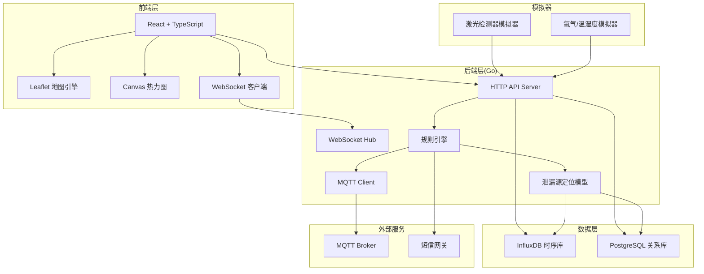
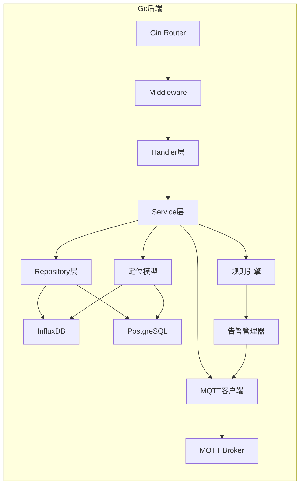
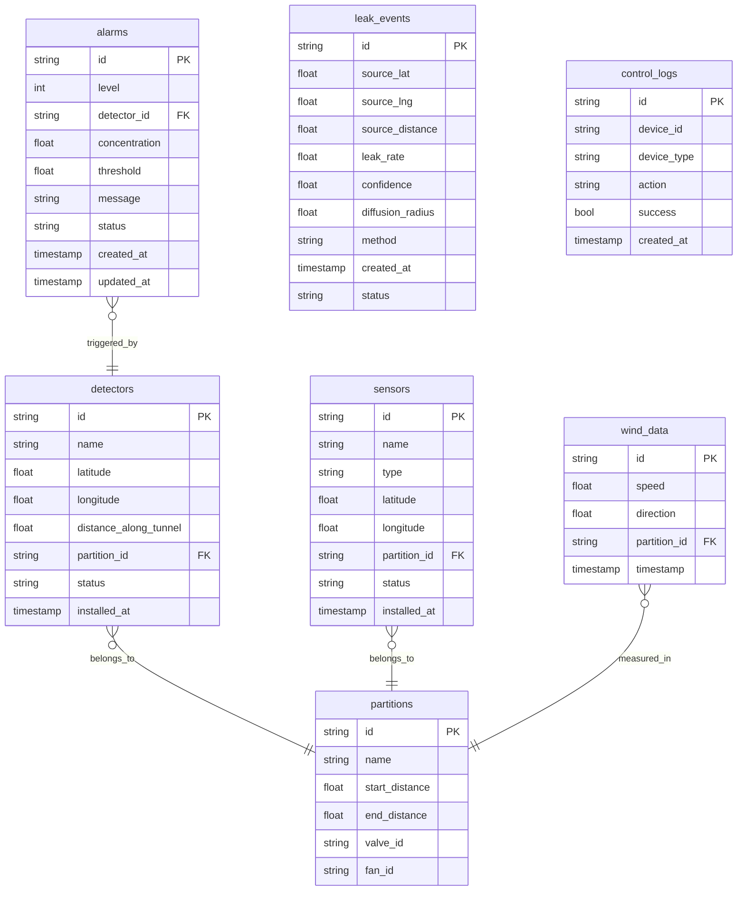

# 智慧城市地下综合管廊燃气泄漏激光监测与联动处置系统 - 技术架构文档

## 1. 架构设计



## 2. 技术说明

- **前端**: React@18 + TypeScript + Vite + TailwindCSS + Leaflet + Canvas API
- **后端**: Go 1.21+ + Gin(HTTP) + Gorilla WebSocket + Eclipse Paho MQTT
- **时序数据库**: InfluxDB 2.x（甲烷浓度、氧气、温湿度时序数据）
- **关系数据库**: PostgreSQL 15（设备元数据、告警记录、用户信息）
- **消息中间件**: MQTT Broker（EMQX/Mosquitto）用于设备通信和联动控制
- **初始化工具**: Vite

## 3. 路由定义

| 路由 | 用途 |
|------|------|
| `/` | 实时监测大屏（主页面） |
| `/alarms` | 告警管理列表 |
| `/control` | 应急联动控制面板 |

## 4. API定义

### 4.1 设备数据接口

```typescript
interface DetectorData {
  detector_id: string;
  concentration: number;     // 甲烷浓度 %LEL
  timestamp: string;         // ISO8601
  status: "online" | "offline" | "fault";
}

interface SensorData {
  sensor_id: string;
  type: "o2" | "temperature" | "humidity";
  value: number;
  unit: string;
  timestamp: string;
  status: "online" | "offline" | "fault";
}
```

### 4.2 检测器历史数据接口

```typescript
interface DetectorHistoryRequest {
  detector_id: string;
  start: string;             // ISO8601
  end: string;               // ISO8601
  interval: string;          // "1m" | "5m" | "15m"
}

interface DetectorHistoryResponse {
  detector_id: string;
  points: Array<{
    time: string;
    avg: number;
    max: number;
    min: number;
  }>;
}
```

### 4.3 告警接口

```typescript
interface Alarm {
  id: string;
  level: 1 | 2 | 3;
  detector_id: string;
  concentration: number;
  threshold: number;
  message: string;
  status: "active" | "acknowledged" | "resolved";
  created_at: string;
  updated_at: string;
}

interface AlarmListResponse {
  total: number;
  items: Alarm[];
}
```

### 4.4 泄漏源定位接口

```typescript
interface LeakSourceRequest {
  detector_ids: string[];
  concentrations: number[];
  wind_speed: number;
  wind_direction: number;
}

interface LeakSourceResult {
  source_position: { lat: number; lng: number; distance: number };
  leak_rate: number;           // L/min
  confidence: number;          // 0-1
  diffusion_radius: number;   // meters
  method: "pso" | "bayesian";
  timestamp: string;
}
```

### 4.5 联动控制接口

```typescript
interface ControlCommand {
  device_id: string;
  device_type: "valve" | "fan" | "notification";
  action: "open" | "close" | "start" | "stop" | "send";
  partition_id?: string;
  message?: string;
}

interface ControlResult {
  success: boolean;
  device_id: string;
  new_state: string;
  timestamp: string;
}
```

### 4.6 API端点列表

| 方法 | 路径 | 用途 |
|------|------|------|
| GET | `/api/detectors` | 获取所有检测器列表及最新状态 |
| GET | `/api/detectors/:id/history` | 获取检测器历史浓度数据 |
| GET | `/api/detectors/:id/health` | 获取检测器健康状态 |
| GET | `/api/sensors` | 获取氧气/温湿度传感器列表及最新数据 |
| GET | `/api/alarms` | 获取告警列表（支持筛选） |
| PUT | `/api/alarms/:id/acknowledge` | 确认告警 |
| PUT | `/api/alarms/:id/resolve` | 解除告警 |
| POST | `/api/leak/locate` | 触发泄漏源定位计算 |
| GET | `/api/leak/latest` | 获取最新泄漏源定位结果 |
| POST | `/api/control/valve` | 控制阀门开关 |
| POST | `/api/control/fan` | 控制排风机启停 |
| POST | `/api/control/notify` | 发送疏散通知 |
| GET | `/api/partitions` | 获取防火分区信息 |
| WS | `/ws` | WebSocket实时数据推送 |

## 5. 后端架构图



## 6. 数据模型

### 6.1 数据模型定义



### 6.2 数据定义语言

**PostgreSQL DDL:**

```sql
-- 防火分区表
CREATE TABLE partitions (
    id VARCHAR(32) PRIMARY KEY,
    name VARCHAR(100) NOT NULL,
    start_distance FLOAT NOT NULL,
    end_distance FLOAT NOT NULL,
    valve_id VARCHAR(32),
    fan_id VARCHAR(32)
);

-- 激光甲烷检测器表
CREATE TABLE detectors (
    id VARCHAR(32) PRIMARY KEY,
    name VARCHAR(100) NOT NULL,
    latitude FLOAT NOT NULL,
    longitude FLOAT NOT NULL,
    distance_along_tunnel FLOAT NOT NULL,
    partition_id VARCHAR(32) REFERENCES partitions(id),
    status VARCHAR(20) DEFAULT 'online',
    installed_at TIMESTAMP DEFAULT NOW()
);

-- 氧气/温湿度传感器表
CREATE TABLE sensors (
    id VARCHAR(32) PRIMARY KEY,
    name VARCHAR(100) NOT NULL,
    type VARCHAR(20) NOT NULL,
    latitude FLOAT NOT NULL,
    longitude FLOAT NOT NULL,
    partition_id VARCHAR(32) REFERENCES partitions(id),
    status VARCHAR(20) DEFAULT 'online',
    installed_at TIMESTAMP DEFAULT NOW()
);

-- 告警记录表
CREATE TABLE alarms (
    id VARCHAR(32) PRIMARY KEY,
    level INT NOT NULL,
    detector_id VARCHAR(32) REFERENCES detectors(id),
    concentration FLOAT NOT NULL,
    threshold FLOAT NOT NULL,
    message TEXT,
    status VARCHAR(20) DEFAULT 'active',
    created_at TIMESTAMP DEFAULT NOW(),
    updated_at TIMESTAMP DEFAULT NOW()
);

-- 泄漏事件表
CREATE TABLE leak_events (
    id VARCHAR(32) PRIMARY KEY,
    source_lat FLOAT NOT NULL,
    source_lng FLOAT NOT NULL,
    source_distance FLOAT NOT NULL,
    leak_rate FLOAT NOT NULL,
    confidence FLOAT NOT NULL,
    diffusion_radius FLOAT NOT NULL,
    method VARCHAR(20) NOT NULL,
    created_at TIMESTAMP DEFAULT NOW(),
    status VARCHAR(20) DEFAULT 'active'
);

-- 联动控制日志表
CREATE TABLE control_logs (
    id VARCHAR(32) PRIMARY KEY,
    device_id VARCHAR(32) NOT NULL,
    device_type VARCHAR(20) NOT NULL,
    action VARCHAR(20) NOT NULL,
    success BOOLEAN DEFAULT TRUE,
    created_at TIMESTAMP DEFAULT NOW()
);

-- 风速风向数据表
CREATE TABLE wind_data (
    id VARCHAR(32) PRIMARY KEY,
    speed FLOAT NOT NULL,
    direction FLOAT NOT NULL,
    partition_id VARCHAR(32) REFERENCES partitions(id),
    timestamp TIMESTAMP DEFAULT NOW()
);

CREATE INDEX idx_alarms_detector ON alarms(detector_id);
CREATE INDEX idx_alarms_status ON alarms(status);
CREATE INDEX idx_alarms_created ON alarms(created_at);
CREATE INDEX idx_detectors_partition ON detectors(partition_id);
CREATE INDEX idx_leak_events_status ON leak_events(status);
```

**InfluxDB Measurement设计:**

```
measurement: methane_concentration
  tags: detector_id, partition_id
  fields: concentration (float), status (string)

measurement: sensor_o2
  tags: sensor_id, partition_id
  fields: value (float), status (string)

measurement: sensor_temperature
  tags: sensor_id, partition_id
  fields: value (float), status (string)

measurement: sensor_humidity
  tags: sensor_id, partition_id
  fields: value (float), status (string)

measurement: wind
  tags: partition_id
  fields: speed (float), direction (float)
```
